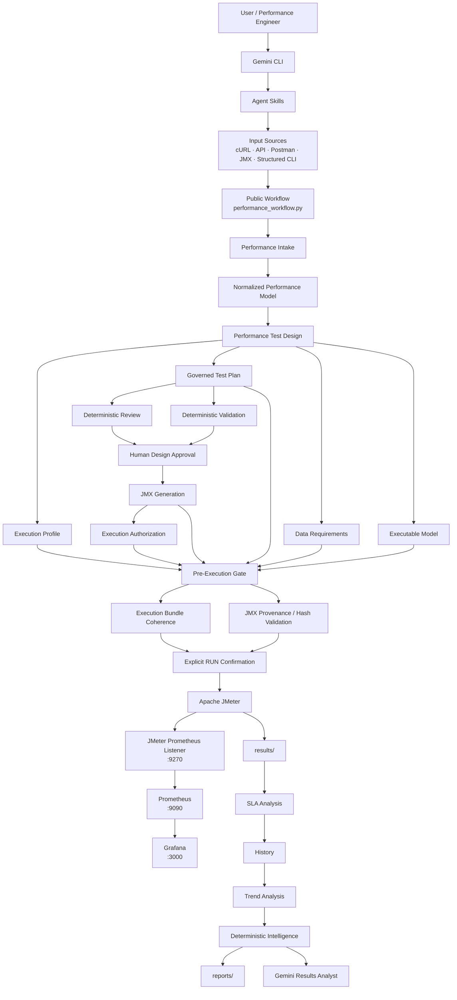

# AI-Assisted Performance Engineering Platform

Plataforma de **Performance Engineering asistida por IA** diseñada para convertir requisitos funcionales, APIs, colecciones Postman, cURL y artefactos JMeter en pruebas de rendimiento reproducibles, gobernadas y auditables.

La plataforma combina:

- **Gemini CLI + Agent Skills** para discovery, diseño e interpretación.
- **Python** para los controles determinísticos y el state machine.
- **Apache JMeter** como motor de carga.
- **Prometheus + Grafana** para observabilidad en tiempo real.
- **Human-in-the-loop governance** para aprobación y autorización.
- **Artifacts + hashes + manifests** para garantizar coherencia y trazabilidad.
- **History, Trend e Intelligence** para análisis posterior a la ejecución.

La IA puede proponer y explicar.

La autorización, el workload, la ejecución y el veredicto final permanecen controlados por el pipeline.

---

# 1. Objetivo

El objetivo de la plataforma es transformar una entrada funcional o técnica en un ciclo completo de Performance Engineering:

```text
Requirement / API / cURL / Postman / JMX
                  │
                  ▼
        Gemini CLI + Agent Skills
                  │
                  ▼
          Discovery & Intake
                  │
                  ▼
       Normalized Performance Model
                  │
                  ▼
         Performance Test Design
                  │
                  ▼
 ┌─────────────────────────────────────┐
 │ test-plan.yaml                      │
 │ test-plan.md                        │
 │ data-requirements.json              │
 │ execution-profile.yaml              │
 │ executable-model.json               │
 └─────────────────────────────────────┘
                  │
                  ▼
      Deterministic Validation
                  │
                  ▼
         Deterministic Review
                  │
                  ▼
            Human Approval
                  │
                  ▼
           JMX Generation
                  │
                  ▼
       JMX Provenance Validation
                  │
                  ▼
      Execution Authorization
                  │
                  ▼
            Preflight Gate
                  │
                  ▼
         PRE_EXECUTION_READY
                  │
                  ▼
          Explicit user RUN
                  │
                  ▼
             Apache JMeter
                  │
        ┌─────────┴─────────┐
        ▼                   ▼
 Prometheus / Grafana     JTL / Logs
        │                   │
        └─────────┬─────────┘
                  ▼
             SLA Analysis
                  │
                  ▼
          History + Trends
                  │
                  ▼
      Deterministic Intelligence
                  │
                  ▼
        Gemini Results Analysis
                  │
                  ▼
          Engineering Decision
```

La IA participa principalmente en:

```text
Discovery
Design
Interpretation
Explanation
Recommendations
```

Los controles determinísticos permanecen responsables de:

```text
Validation
Workload enforcement
Authorization
Artifact integrity
Execution
SLA evaluation
Risk calculation
Evidence
History
Trend
Final deterministic verdict
```

---

# 2. Principio de arquitectura

```text
AI proposes.

Deterministic controls verify.

Humans approve.

The platform authorizes.

JMeter executes.

Evidence decides.

AI explains.
```

La plataforma evita que un modelo de IA pueda ejecutar carga arbitrariamente.

El modelo puede diseñar una prueba, pero el pipeline debe validar y aprobar los artefactos antes de permitir una ejecución.

---

# 3. Arquitectura actual



## Vista por capas

```text
┌───────────────────────────────────────────────────────────────┐
│                    AI INTERACTION LAYER                       │
│                                                               │
│  Gemini CLI                                                  │
│  Agent Skills                                                │
│  Natural-language requirements                               │
└───────────────────────────┬───────────────────────────────────┘
                            │
                            ▼
┌───────────────────────────────────────────────────────────────┐
│                    GOVERNANCE LAYER                           │
│                                                               │
│  performance_workflow.py                                     │
│  Review                                                       │
│  Validation                                                   │
│  Approval                                                     │
│  Authorization                                                │
│  Preflight                                                    │
│  Execution bundle coherence                                  │
└───────────────────────────┬───────────────────────────────────┘
                            │
                            ▼
┌───────────────────────────────────────────────────────────────┐
│                      DESIGN LAYER                             │
│                                                               │
│  normalized-performance-model.json                           │
│  test-plan.yaml                                               │
│  test-plan.md                                                 │
│  data-requirements.json                                       │
│  execution-profile.yaml                                       │
│  executable-model.json                                        │
│  JMX                                                          │
└───────────────────────────┬───────────────────────────────────┘
                            │
                            ▼
┌───────────────────────────────────────────────────────────────┐
│                     EXECUTION LAYER                           │
│                                                               │
│  Apache JMeter                                                │
│  Runtime properties                                           │
│  Correlations                                                 │
│  Parameterization                                             │
│  Controlled workload                                          │
└───────────────────────────┬───────────────────────────────────┘
                            │
               ┌────────────┴────────────┐
               ▼                         ▼
┌─────────────────────────┐   ┌─────────────────────────────┐
│ OBSERVABILITY           │   │ EVIDENCE                    │
│                         │   │                             │
│ Prometheus              │   │ JTL                         │
│ Grafana                 │   │ JMeter logs                 │
│ JMeter Listener         │   │ Metadata                    │
└────────────┬────────────┘   └──────────────┬──────────────┘
             │                               │
             └──────────────┬────────────────┘
                            ▼
┌───────────────────────────────────────────────────────────────┐
│                    ANALYTICS LAYER                            │
│                                                               │
│  SLA Analysis                                                 │
│  History                                                      │
│  Trend Analysis                                               │
│  Deterministic Intelligence                                   │
│  Gemini Results Analysis                                      │
│  Executive Reports                                            │
└───────────────────────────────────────────────────────────────┘
```

---

# 4. Tipos de entrada soportados

La arquitectura trabaja sobre un modelo normalizado para evitar que la lógica de diseño dependa del formato de origen.

```text
                       INPUT
                         │
         ┌───────────────┼────────────────┐
         │               │                │
         ▼               ▼                ▼
      Postman           JMX             CLI
         │               │                │
         │               │        ┌───────┼──────────┐
         │               │        ▼       ▼          ▼
         │               │      cURL    YAML       JSON
         │               │
         └───────────────┼────────────────┘
                         ▼
          Normalized Performance Model
                         │
                         ▼
                  Common Pipeline
```

### Postman

Entrada:

```text
*.postman_collection.json
```

Opcionalmente:

```text
Postman environment
```

La plataforma puede detectar:

```text
requests
variables
runtime parameters
authentication
correlations
resource IDs
secrets
content negotiation
multi-request scenarios
```

---

### cURL

cURL es tratado como un formato de entrada de tipo CLI.

Ejemplo:

```bash
curl --request POST \
  --url https://dummyjson.com/products/add \
  --header 'Content-Type: application/json' \
  --header 'Accept: application/json' \
  --data '{
    "title": "Performance Test Product"
  }'
```

La plataforma preserva:

```text
HTTP method
URL
headers
JSON body
target
path
```

Internamente:

```text
cURL
 ↓
.curl artifact
 ↓
--input-type cli
 ↓
PARSE_CURL
 ↓
Normalized Performance Model
```

`curl` es un **source format**, no un valor público de `--input-type`.

---

### Structured CLI

También pueden definirse escenarios en:

```text
.json
.yaml
.yml
```

Esto permite representar:

```text
single request
multi-request E2E
headers
bodies
runtime parameters
secrets
correlations
JSON Path extractors
expected HTTP status
```

---

### JMX

Un `.jmx` existente puede ingresar al pipeline para análisis y normalización.

Esto permite trabajar con:

```text
JMX creados manualmente
JMX existentes
JMX obtenidos mediante grabación de navegación web
JMX provenientes de herramientas externas
```

El parser puede detectar componentes JMeter como:

```text
ThreadGroup
HTTPSamplerProxy
HeaderManager
CSVDataSet
JSONPostProcessor
RegexExtractor
Timers
Assertions
```

---

# 5. Agent Skills

Las skills están disponibles en:

```text
.gemini/skills/
```

Actualmente:

```text
chief-performance-engineer
performance-engineer
performance-test-designer
performance-test-runner
performance-results-analyst
```

## performance-test-designer

Responsable principalmente de:

```text
discovery
intake
scenario design
workload proposal
data requirements
correlation analysis
test plan generation
JMX preparation
```

## performance-test-runner

Responsable de coordinar la ejecución gobernada después de que el diseño y la autorización estén completos.

## performance-results-analyst

Responsable de interpretar:

```text
execution evidence
SLA
latency
throughput
errors
trend
risk
deterministic intelligence
```

## chief-performance-engineer

Skill de mayor nivel para razonamiento de Performance Engineering, diseño de estrategia y análisis global.

## GEMINI.md

`GEMINI.md` contiene las reglas globales de comportamiento del proyecto.

Las skills no deben saltarse las reglas definidas allí.

---

# 6. State Machine

La plataforma utiliza un workflow explícito:

```text
INTAKE
  │
  ▼
REVIEW
  │
  ▼
APPROVE
  │
  ▼
AUTHORIZE
  │
  ▼
PREFLIGHT
  │
  ▼
EXECUTE
```

Estados conceptuales:

```text
┌────────────────┬────────────┬─────────────────┐
│ Plan           │ Workload   │ Execution       │
├────────────────┼────────────┼─────────────────┤
│ DRAFT          │ PROPOSED   │ PENDING         │
│ APPROVED       │ APPROVED   │ PENDING         │
│ APPROVED       │ APPROVED   │ AUTHORIZED      │
└────────────────┴────────────┴─────────────────┘
```

La aprobación de diseño **NO** equivale a autorización de ejecución.

---

# 7. Public Workflow

El entry point público es:

```text
scripts/performance_workflow.py
```

Operaciones disponibles:

```bash
poetry run python scripts/performance_workflow.py intake ...
poetry run python scripts/performance_workflow.py review ...
poetry run python scripts/performance_workflow.py approve ...
poetry run python scripts/performance_workflow.py authorize ...
poetry run python scripts/performance_workflow.py preflight ...
poetry run python scripts/performance_workflow.py execute ...
poetry run python scripts/performance_workflow.py contract
```

Consultar el contrato público:

```bash
poetry run python scripts/performance_workflow.py contract
```

La interfaz pública no permite alterar arbitrariamente workload durante `execute`.

Los parámetros de ejecución deben provenir del workload previamente aprobado.

---

# 8. Seguridad del workflow

No persistir en Git:

```text
API keys
OAuth tokens
passwords
session cookies
Authorization headers
client secrets
private keys
production credentials
```

Los secretos deben resolverse durante runtime mediante mecanismos seguros.

La autenticación de Gemini también debe permanecer fuera del repositorio.

Nunca incluir credenciales directamente en:

```text
test-plan.yaml
JMX
CSV
logs
reports
Git history
```

---

# 9. Execution Governance

Una prueba no puede ejecutarse únicamente porque el plan exista.

Antes de ejecutar deben cumplirse:

```text
Plan                = APPROVED
Workload            = APPROVED
Authorization       = AUTHORIZED
Execution profile   = VALID
Execution bundle    = COHERENT
JMX provenance      = VALID
Artifact hashes     = VERIFIED
Preflight status    = PRE_EXECUTION_READY
```

Después de esto todavía existe una confirmación final.

```text
Type exactly:

RUN
```

`RUN` es únicamente la confirmación final.

No reemplaza:

```text
approval
authorization
preflight
artifact validation
```

---

# 10. Pre-Execution Gate

El preflight valida el bundle completo antes de permitir carga.

Ejemplo de salida esperada:

```text
EXECUTION BUNDLE COHERENCE
Status : PASS

CLI EXECUTABLE MODEL VS JMX
Status : PASS

JMX ARTIFACT VALID

PRE-EXECUTION GATE SUMMARY
Failed       : 0
Final status : PRE_EXECUTION_READY

AUTHORIZATION CHECK: AUTHORIZED

EXECUTION NOT STARTED - PREFLIGHT ONLY
```

El gate valida entre otras cosas:

```text
environment
plan
workload
authorization
execution profile
profile vs approved workload
scenario identity
source binding
data requirements
design context
JMX
JMX metadata
artifact hashes
Prometheus configuration
```

---

# 11. Execution Bundle

Los artefactos utilizados para ejecutar deben pertenecer exactamente al mismo escenario.

Conceptualmente:

```text
                 Approved Scenario
                        │
       ┌────────────────┼─────────────────┐
       │                │                 │
       ▼                ▼                 ▼
   Test Plan      Data Requirements   Executable Model
       │                │                 │
       └──────────────┬─┴─────────────────┘
                      ▼
                   JMX
                      │
                      ▼
             Execution Profile
                      │
                      ▼
                 Manifest
```

El bundle validator comprueba que las identidades coincidan:

```text
Plan scenario
Context candidate
Data candidate
JMX scenario
```

Si existe una discrepancia, la ejecución se bloquea.

---

# 12. Artifact Provenance

El JMX generado tiene metadata asociada.

La validación comprueba:

```text
Plan hash   : MATCH
JMX hash    : MATCH
Target      : MATCH
Workload    : MATCH
XML         : VALID
```

Si el plan cambia después de aprobar o autorizar, la metadata debe actualizarse o regenerarse antes de ejecutar.

Esto evita ejecutar un JMX diferente al que fue aprobado.

---

# 13. Estructura principal

```text
.
├── config/
│   ├── project-config.yaml
│   ├── sla.json
│   ├── agent-registry.yaml
│   └── execution-profiles/
│
├── knowledge/
│   └── Performance Engineering knowledge
│
├── scripts/
│   ├── performance_workflow.py
│   ├── performance_intake.py
│   ├── prepare_cli_design.py
│   ├── parse_curl_request.py
│   ├── parse_jmx.py
│   ├── parse_postman_collection.py
│   ├── compile_normalized_test_plan.py
│   ├── compile_normalized_executable_model.py
│   ├── validate_test_plan.py
│   ├── review_test_plan.py
│   ├── approve_test_plan.py
│   ├── authorize_execution.py
│   ├── pre_execution_gate.py
│   ├── validate_execution_bundle.py
│   ├── validate_jmx_artifact.py
│   ├── validate_cli_jmx.py
│   ├── run_approved_plan.py
│   ├── run_test.py
│   ├── analyze_results.py
│   ├── generate_report.py
│   ├── history_manager.py
│   ├── trend_analyzer.py
│   └── intelligence_engine.py
│
├── tests/
│   ├── plans/
│   └── generated/
│
├── work/
│   ├── intake/
│   └── pre-execution/
│
├── workspaces/
│
├── results/
├── reports/
├── history/
│
├── grafana/
├── prometheus.yml
├── docker-compose.yml
│
├── .gemini/
│   └── skills/
│
├── GEMINI.md
├── Makefile
├── pyproject.toml
└── poetry.lock
```

---

# 14. Instalación

## Requisitos

```text
Python 3.11+
Poetry
Java 17+
Apache JMeter 5.6.x
Docker
Docker Compose
Gemini CLI
```

Versiones utilizadas durante la demo:

```text
Apache JMeter 5.6.3
Java 17
Prometheus
Grafana
```

Instalar dependencias:

```bash
poetry install
```

Validar el entorno:

```bash
make validate
```

También puede ejecutarse:

```bash
poetry run python scripts/validate_environment.py
```

---

# 15. Levantar observabilidad

La observabilidad utiliza Docker Compose.

Desde la raíz:

```bash
cd /ruta/al/proyecto
```

Levantar los servicios:

```bash
docker compose up -d
```

Verificar:

```bash
docker compose ps
```

Comprobar Docker:

```bash
docker info
```

Si se necesita revisar logs:

```bash
docker compose logs
```

o seguirlos:

```bash
docker compose logs -f
```

Detener servicios:

```bash
docker compose down
```

---

# 16. Prometheus

Prometheus está disponible en:

```text
http://localhost:9090
```

Abrir desde macOS:

```bash
open http://localhost:9090
```

Estado de targets:

```text
http://localhost:9090/targets
```

También puede consultarse mediante API:

```bash
curl -s http://localhost:9090/api/v1/targets
```

Durante una ejecución JMeter expone métricas mediante:

```text
http://localhost:9270/metrics
```

Prometheus obtiene estas métricas utilizando el target:

```text
host.docker.internal:9270
```

---

# 17. Métricas JMeter en Prometheus

El JMX incorpora el Prometheus Listener.

Métricas principales:

```text
jmeter_requests_total
jmeter_success_total
jmeter_error_total
jmeter_response_time_ms
```

El puerto es configurable mediante:

```text
prometheus_port
```

Default:

```text
9270
```

Cuando JMeter no está ejecutándose el exporter puede estar inactivo.

Esto no representa necesariamente un fallo del sistema.

Conceptualmente:

```text
JMeter idle
→ Metrics exporter INACTIVE

JMeter running
→ Metrics exporter ACTIVE
```

---

# 18. Grafana

Grafana está disponible en:

```text
http://localhost:3000
```

Abrir en macOS:

```bash
open http://localhost:3000
```

El dashboard permite visualizar durante una ejecución:

```text
Current Throughput
Current p95
Error Rate
Active Virtual Users
JMeter Execution State
Throughput by Sampler
Response Time Percentiles
Virtual Users Over Time
Errors by Sampler
Total Requests
```

Flujo de métricas:

```text
Apache JMeter
      │
      ▼
Prometheus Listener
      │
      ▼
localhost:9270/metrics
      │
      ▼
Prometheus
localhost:9090
      │
      ▼
Grafana
localhost:3000
```

---

# 19. AI-First Workflow

La manera recomendada de utilizar la plataforma es mediante Gemini CLI.

Desde la raíz:

```bash
gemini
```

Ejemplo de prompt:

```text
Diseña de forma autónoma una prueba de Performance Engineering para:

curl --request POST \
  --url https://dummyjson.com/products/add \
  --header 'Content-Type: application/json' \
  --header 'Accept: application/json' \
  --data '{
    "title": "Performance Test Product"
  }'

Scenario: dummyjson-create-product-demo.

Carga requerida:
- 10 usuarios virtuales
- ramp-up de 100 segundos
- duración de 120 segundos
- pacing de 2 segundos

Usa performance-test-designer y sigue completamente su workflow público
y el state machine definido en GEMINI.md.

Genera automáticamente los artefactos necesarios.

No ejecutes JMeter.

Detente para mi aprobación cuando review y validation pasen.
```

Gemini debe encargarse de:

```text
cURL
 ↓
Intake
 ↓
Normalized Model
 ↓
Governed Plan
 ↓
Governance Synchronization
 ↓
Validation
 ↓
Review
 ↓
Executable Model
 ↓
JMX
 ↓
READY FOR HUMAN REVIEW
```

---

# 20. Diseño

Al finalizar el intake deben existir artefactos similares a:

```text
tests/plans/<scenario>/test-plan.yaml

tests/plans/<scenario>/test-plan.md

tests/plans/<scenario>/data-requirements.json

workspaces/<scenario>/execution-profile.yaml

workspaces/<scenario>/normalized-performance-model.json

workspaces/<scenario>/executable-model.json

workspaces/<scenario>/design-manifest.json

tests/generated/<scenario>.jmx
```

Estado inicial:

```text
Plan          : DRAFT
Workload      : PROPOSED
Authorization : PENDING
JMeter        : NOT EXECUTED
```

---

# 21. Review

El review analiza:

```text
workload quality
SLA
artifact consistency
security
data contract
authorization state
observability
scenario coherence
duration
risks
```

Ejemplo:

```bash
poetry run python \
  scripts/performance_workflow.py review \
  --plan tests/plans/<scenario>/test-plan.yaml
```

Resultado esperado:

```text
Status   : PASS
Errors   : 0
Warnings : 0

READY FOR HUMAN REVIEW
```

---

# 22. Approval

Después de revisar el diseño:

```bash
poetry run python \
  scripts/performance_workflow.py approve \
  --plan tests/plans/<scenario>/test-plan.yaml \
  --jmx tests/generated/<scenario>.jmx \
  --approved-by "Nombre Apellido"
```

Resultado:

```text
Plan status   : APPROVED
Workload      : APPROVED
Authorization : PENDING
```

Todavía no puede ejecutarse carga.

---

# 23. Authorization

La ejecución debe autorizarse independientemente del diseño.

```bash
poetry run python \
  scripts/performance_workflow.py authorize \
  --plan tests/plans/<scenario>/test-plan.yaml \
  --jmx tests/generated/<scenario>.jmx \
  --authorized-by "Nombre Apellido"
```

Resultado:

```text
Plan          : APPROVED
Workload      : APPROVED
Authorization : AUTHORIZED
```

La autorización no ejecuta JMeter.

---

# 24. Preflight

Ejemplo para un escenario CLI/cURL:

```bash
poetry run python \
  scripts/performance_workflow.py preflight \
  --plan tests/plans/<scenario>/test-plan.yaml \
  --profile workspaces/<scenario>/execution-profile.yaml \
  --jmx tests/generated/<scenario>.jmx \
  --data-requirements tests/plans/<scenario>/data-requirements.json \
  --design-context workspaces/<scenario>/executable-model.json \
  --manifest work/pre-execution/<scenario>.json
```

Una ejecución preparada debe finalizar con:

```text
Failed       : 0
Final status : PRE_EXECUTION_READY

AUTHORIZATION CHECK: AUTHORIZED

EXECUTION NOT STARTED - PREFLIGHT ONLY
```

---

# 25. Confirmación RUN

Después del preflight:

```text
PRE_EXECUTION_READY
```

la plataforma puede solicitar:

```text
Para iniciar la carga controlada escribe exactamente:

RUN
```

Esta confirmación existe para evitar ejecuciones accidentales.

`RUN` no debe utilizarse para saltarse:

```text
review
approval
authorization
preflight
```

---

# 26. Ejecución

La ejecución controlada utiliza:

```text
performance_workflow.py execute
```

No ejecutar directamente `run_test.py`.

`run_test.py` es una implementación interna del pipeline.

Nunca exponer como interfaz de usuario:

```text
run_test.py --authorized
```

ni mecanismos equivalentes para omitir el state machine.

---

# 27. Ejemplo de resultado

Una ejecución puede finalizar con:

```text
Operation : EXECUTE
Status    : COMPLETE
```

Y producir un resumen como:

```text
Deterministic Verdict : PASS
Decision              : ACCEPT
Risk                  : LOW
Throughput            : 2.843 req/s
p95                   : 326.9 ms
p99                   : 540.53 ms
Success Rate          : 100%
```

Un `PASS` significa únicamente que la ejecución evaluada cumplió los SLA configurados.

No implica automáticamente:

```text
production capacity
maximum TPS
long-duration stability
infrastructure scalability
database scalability
```

---

# 28. Results

Cada ejecución crea un identificador único.

Ejemplo:

```text
20260824_095801
```

Los resultados se almacenan bajo:

```text
results/
```

Dependiendo de la ejecución pueden incluir:

```text
results.jtl
jmeter.log
analysis.json
metadata.json
trend.json
intelligence.json
```

---

# 29. Reports

Los reportes se almacenan bajo:

```text
reports/
```

Cada ejecución puede producir:

```text
executive-report.html
jmeter/index.html
intelligence-report.md
evidence.json
```

---

# 30. Abrir reportes

En macOS:

```bash
open reports/<execution-id>/executive-report.html
```

Para el reporte estándar de JMeter:

```bash
open reports/<execution-id>/jmeter/index.html
```

También puede abrirse la carpeta completa:

```bash
open reports/<execution-id>
```

Resultados:

```bash
open results/<execution-id>
```

---

# 31. Evidence

La plataforma mantiene evidencia de:

```text
scenario
target
workload
timestamps
JMX
plan
authorization
results
SLA
risk
decision
artifact hashes
```

Esto permite reconstruir qué fue ejecutado y bajo qué autorización.

---

# 32. SLA

Los SLA globales se definen en:

```text
config/sla.json
```

Ejemplo conceptual:

```text
Error Rate
p95
p99
Minimum Throughput
```

El pipeline compara los resultados reales con estos thresholds.

---

# 33. Interpretación de resultados

Orden recomendado:

```text
1. Technical execution status
2. Evidence completeness
3. Error rate
4. SLA verdict
5. Throughput
6. p95
7. p99
8. History
9. Trend
10. Risk
11. Deterministic intelligence
12. Limitations
13. Hypotheses
14. Recommended next experiment
```

Un resultado aislado debe interpretarse dentro de su contexto.

---

# 34. History

La plataforma mantiene historial para poder comparar ejecuciones equivalentes.

```text
history/
```

Cada ejecución puede alimentar:

```text
scenario history
latency evolution
throughput evolution
error evolution
risk evolution
```

---

# 35. Trend Analysis

Para calcular tendencia se requieren al menos dos ejecuciones comparables.

Primera ejecución:

```text
Trend: NOT ENOUGH HISTORY
```

Ejecuciones posteriores:

```text
IMPROVING
STABLE
DEGRADING
```

según las reglas determinísticas configuradas.

---

# 36. Deterministic Intelligence

La plataforma genera inteligencia adicional basada en evidencia.

Puede considerar:

```text
SLA
p95
p99
throughput
errors
history
trend
risk
technical anomalies
```

La decisión determinística no debe ser reemplazada por una inferencia de IA.

---

# 37. AI Results Analysis

Después de obtener los resultados determinísticos, Gemini puede utilizar:

```text
performance-results-analyst
```

para explicar:

```text
what happened
why it may matter
possible bottlenecks
limitations
next experiments
engineering recommendations
```

Las hipótesis generadas por IA deben mantenerse diferenciadas de los hechos medidos.

---

# 38. Observability Limitations

Prometheus actualmente observa métricas expuestas desde JMeter.

La ausencia de métricas server-side debe considerarse una **evidence gap**.

No inferir automáticamente:

```text
CPU usage
memory pressure
database utilization
GC pressure
thread pools
connection pools
network saturation
disk I/O
```

sin telemetría real del sistema bajo prueba.

---

# 39. Smoke Test

Ejecutar:

```bash
make smoke
```

El smoke test:

```text
NO ejecuta carga
```

Valida:

```text
project structure
configuration
scripts
skills
test plan
data requirements
JMX
JMX provenance
Docker
Docker Compose
```

Resultado esperado:

```text
SMOKE TEST: PASS

JMX provenance: VALID

No performance load was executed.
```

---

# 40. Regression Tests

Para ejecutar la suite principal:

```bash
poetry run python -m unittest \
  tests.test_multi_input_core \
  tests.test_postman_pipeline \
  tests.test_postman_e2e_compiler \
  tests.test_postman_jmx_content_negotiation \
  tests.test_performance_workflow \
  tests.test_run_approved_plan \
  tests.test_execution_bundle \
  tests.test_pre_execution_gate \
  -v
```

Antes de una demo o modificación importante se recomienda ejecutar:

```bash
poetry run python -m unittest \
  tests.test_multi_input_core \
  tests.test_postman_pipeline \
  tests.test_postman_e2e_compiler \
  tests.test_postman_jmx_content_negotiation \
  tests.test_performance_workflow \
  tests.test_run_approved_plan \
  tests.test_execution_bundle \
  tests.test_pre_execution_gate \
  -v

make smoke
```

---

# 41. Comandos principales

```bash
make help

make validate

make smoke

make review-plan

make validate-plan

make approve-plan APPROVED_BY="Nombre Apellido"

make generate-jmx

make run-demo

make status

make clean-runtime
```

`make clean-runtime` debe eliminar únicamente artefactos temporales regenerables.

No debe eliminar:

```text
history
results
reports
```

---

# 42. Troubleshooting

## Docker no disponible

Verificar Docker Desktop.

```bash
docker info
```

Después:

```bash
docker compose ps
```

Si los servicios no están levantados:

```bash
docker compose up -d
```

---

## Prometheus no responde

Verificar:

```bash
docker compose ps
```

Abrir:

```bash
open http://localhost:9090
```

Targets:

```bash
open http://localhost:9090/targets
```

---

## Grafana no responde

```bash
docker compose ps
```

Abrir:

```bash
open http://localhost:3000
```

---

## JMeter metrics aparecen INACTIVE

Esto puede ser correcto cuando no existe una ejecución activa.

El listener de JMeter existe únicamente mientras JMeter está ejecutando el test.

```text
No execution
→ INACTIVE

Execution running
→ ACTIVE
```

---

## Plan inválido

Ejecutar:

```bash
make review-plan

make validate-plan
```

No corregir manualmente artefactos derivados si el pipeline puede regenerarlos.

---

## Execution bundle incoherente

Verificar que correspondan al mismo escenario:

```text
test-plan.yaml
execution-profile.yaml
data-requirements.json
executable-model.json
JMX
manifest
```

No combinar artefactos provenientes de ejecuciones o diseños diferentes.

---

## JMX stale

Si cambia un plan aprobado/autorizado, la metadata del JMX puede quedar desactualizada.

Ejecutar nuevamente el workflow correspondiente para actualizar o regenerar el artefacto.

---

## No existe CSV

Un escenario con:

```text
strategy: NONE
```

no requiere CSV.

La ausencia de CSV no debe considerarse error para ese escenario.

Un CSV solamente debe exigirse cuando el data contract lo requiera explícitamente.

---

## Primera ejecución sin Trend

Es esperado.

Se necesitan al menos dos ejecuciones comparables del mismo escenario.

---

# 43. Demo recomendada

Una demo completa puede seguir este recorrido:

```text
1. Mostrar requisito/cURL.

2. Abrir Gemini CLI.

3. Solicitar diseño autónomo.

4. Mostrar cómo Gemini genera:
   - normalized model
   - test plan
   - data requirements
   - execution profile
   - executable model
   - JMX

5. Mostrar deterministic review.

6. Mostrar human approval.

7. Mostrar execution authorization.

8. Mostrar preflight.

9. Mostrar:
   PRE_EXECUTION_READY

10. Abrir Grafana.

11. Escribir:
    RUN

12. Observar:
    - users
    - throughput
    - p95
    - error rate
    - sampler metrics

13. Mostrar execution result.

14. Abrir executive report.

15. Mostrar history/trend/intelligence.

16. Pedir a Gemini interpretar los resultados.
```

---

# 44. URLs de demo

```text
Grafana
http://localhost:3000

Prometheus
http://localhost:9090

Prometheus Targets
http://localhost:9090/targets

JMeter Prometheus Listener
http://localhost:9270/metrics
```

---

# 45. Demo Health Check

Antes de presentar:

```bash
docker info

docker compose up -d

docker compose ps

make validate

make smoke
```

Comprobar:

```bash
curl -s http://localhost:9090/-/ready
```

Abrir Grafana:

```bash
open http://localhost:3000
```

Abrir Prometheus:

```bash
open http://localhost:9090
```

Después iniciar:

```bash
gemini
```

---

# 46. Reglas importantes

```text
AI must not bypass governance.

Workload changes require a new approval.

Authorization must be explicit.

RUN is only final confirmation.

Artifacts used during execution must belong to the approved scenario.

Secrets must never be persisted.

JMeter must never be executed from the design phase.

Preflight must never execute load.

Deterministic evidence has priority over AI interpretation.
```

---

# 47. Controlled Execution Entry Point

La interfaz pública para usuarios y Agent Skills es:

```text
scripts/performance_workflow.py
```

La ejecución gobernada sigue:

```text
performance_workflow.py
        │
        ▼
run_approved_plan.py
        │
        ▼
pre_execution_gate.py
        │
        ▼
run_test.py
```

Los scripts internos no deben exponerse como mecanismos para saltarse el state machine.

En particular:

```text
run_test.py --authorized
```

no debe utilizarse como comando user-facing.

El flujo correcto siempre es:

```text
REVIEW
  ↓
APPROVE
  ↓
AUTHORIZE
  ↓
PREFLIGHT
  ↓
RUN
  ↓
EXECUTE
```

---

# 48. Resumen

La plataforma está diseñada para que la IA pueda acelerar el Performance Engineering sin convertirse en la autoridad de ejecución.

```text
              AI
              │
      proposes / explains
              │
              ▼
     Deterministic Pipeline
              │
      verifies / governs
              │
              ▼
            Human
              │
           approves
              │
              ▼
            JMeter
              │
           executes
              │
              ▼
           Evidence
              │
           decides
              │
              ▼
              AI
              │
           explains
```

**AI proposes.
Deterministic controls verify.
Humans approve.
JMeter executes.
Evidence decides.
AI explains.**